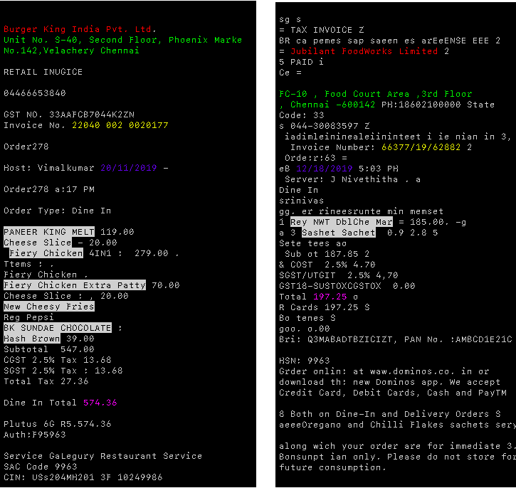

## Bill Label Tool

This folder contains tool for efficiently hand labelling various entity in Invoices.<br/>
**This step works after OCR** i.e it requires all the text to be first extracted from the invoice images.

Natural Language Processing (NLP) has many subsets which involve Text Classification and Named Entity Recognition (NER), this repository is a tool for efficiently labelling datasets for such tasks.
This tool can be easily modified for preparing data for any text classification or NER task, simply by changing labels in `templates/index.html` file.


**Requirements**<br/>
Dependencies for using this tool:
<br/>
1. Flask
2. Pytorch

<br/>
<br/>
**DEMO**
<br/>
Try it out yourself at: https://shubham99bisht.github.io/TextLabelTool/

Here's a demo on how we can efficiently label large dataset quickly!


## Steps:
<br/>

1. Extract all the text and store the .txt files in /data folder. (It is assumed that all files are named sequentially starting from 1)
2. Run
    ```
        $ python3 preprocess.py
    ``` 
3. Start Flask server to start Labelling:
    ```
        $ export FLASK_APP=server.py
        $ flask run
        
        
        Visit: 127.0.0.1:5000/index/1 to start Labelling
     ```
4. Run
    ```
        $python postprocessing.py
        $python generate.py        
     ```
     This will generate a *final_data.pth* file which will contain the entire training data.
     It can be loaded using Pytorch by the following command:
     ```
        dataset = torch.load("final_data.pth")
     ```
## Visualization

To check and verify your labels:
     ```
        $ python color_print.py
     ```
**Sample Output:**<br/>
<br/>


<b>NOTE:</b><br/>
1. This can be run after generating the .json files in results folder.
2. In case `color_print.py` doesn't print output as expected (colour encoding for different labels), then try `color_print2.py`, it uses an external library for printing coloured output.
